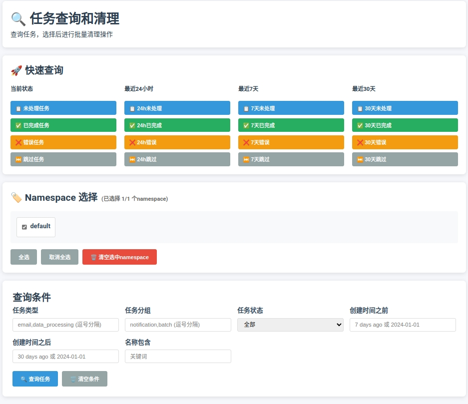

# QTask - 轻量级任务调度系统

一个基于Redis的轻量级任务调度系统，支持任务注册、重试机制、可视化界面和命令行管理。




## 特性

- **轻量级设计**: 极简架构，代码简洁高效
- **任务注册**: 支持装饰器方式注册任务处理器
- **重试机制**: 支持任务级别重试配置
- **可视化界面**: 实时仪表盘、任务管理、分组统计
- **命令行工具**: 完整的CLI管理界面
- **命名空间**: 支持多环境隔离
- **任务查询**: 多条件组合查询和清理

## 安装

```bash
# 从源码安装
git clone <repository>
cd qtask
pip install -e .

# 或直接安装依赖
pip install redis fastapi uvicorn click loguru
```

## 快速开始

### 1. 启动服务器

```bash
# 默认启动 (127.0.0.1:8000)
qtask server

# 指定主机和端口
qtask server --host 0.0.0.0 --port 8080

# 连接远程Redis
qtask server --redis-host redis.example.com --redis-port 6379

# 开发模式（代码变更自动重载）
qtask server --reload
```

### 2. 查看系统状态

```bash
# 查看默认namespace状态
qtask status

# 查看指定namespace状态
qtask status --namespace production
```

### 3. 创建示例任务

```bash
# 创建2个示例任务
qtask demo --count 5

# 在指定namespace创建示例
qtask demo --namespace test --count 10
```

## 使用示例

### 基本任务处理

```python
from qtask.core.task_worker import TaskWorker
from qtask.core.task_publisher import TaskPublisher
from qtask.core.task_storage import TaskStorage
import time

# 创建任务处理器
worker = TaskWorker()

# 注册任务处理器
@worker.register('email', max_retries=3)
def send_email(data):
    """发送邮件任务"""
    email_to = data.get('to')
    subject = data.get('subject')
    content = data.get('content')
    
    # 模拟发送邮件
    time.sleep(1)
    
    if email_to and subject:
        return 'DONE', {'sent': True, 'to': email_to}, '邮件发送成功'
    else:
        return 'ERROR', None, '邮件参数不完整'

@worker.register('backup', max_retries=2)
def backup_data(data):
    """数据备份任务"""
    backup_path = data.get('path')
    
    # 模拟备份操作
    time.sleep(2)
    
    if backup_path:
        return 'DONE', {'backup_path': backup_path}, '备份完成'
    else:
        return 'SKIP', None, '跳过备份：路径未指定'

# 创建任务发布器
publisher = TaskPublisher()

# 发布任务
task_data = {
    'type': 'email',
    'to': 'user@example.com',
    'subject': '测试邮件',
    'content': '这是一封测试邮件'
}

task_id = publisher.publish(task_data)
print(f"任务已发布: {task_id}")

# 处理任务
task = worker.get_next_task()
if task:
    result = worker.process_task(task)
    print(f"任务处理结果: {result}")
```

### 使用命名空间

```python
from qtask.core.config import QTaskConfig
from qtask.core.factory import TaskStorageFactory

# 创建配置
config = QTaskConfig()
config.redis_host = 'localhost'
config.redis_port = 6379
config.default_namespace = 'production'

# 创建工厂
factory = TaskStorageFactory(config)

# 获取不同命名空间的存储
prod_storage = factory.get_storage('production')
test_storage = factory.get_storage('test')

# 发布任务到不同命名空间
publisher_prod = factory.get_publisher('production')
publisher_test = factory.get_publisher('test')

# 生产环境任务
prod_task_id = publisher_prod.publish({
    'type': 'backup',
    'path': '/data/production'
})

# 测试环境任务
test_task_id = publisher_test.publish({
    'type': 'email',
    'to': 'test@example.com',
    'subject': '测试'
})
```

### 任务查询和管理

```python
from qtask.core.task_storage import TaskStorage

# 创建存储实例
storage = TaskStorage()

# 查询错误任务
error_tasks = storage.find_tasks(status='ERROR')
print(f"错误任务数量: {len(error_tasks)}")

# 查询特定分组的任务
email_tasks = storage.find_tasks(group='email')
print(f"邮件任务数量: {len(email_tasks)}")

# 重新排队错误任务
for task_id in error_tasks[:5]:  # 重新排队前5个错误任务
    if storage.requeue_task(task_id):
        print(f"任务 {task_id} 已重新排队")
```

### 命令行管理示例

```bash
# 查看系统状态
qtask status --namespace production

# 查询所有错误任务
qtask query --error --format table

# 查询最近24小时的任务
qtask query --recent --format json

# 清理7天前的已完成任务
qtask clean --done --older-than "7d" --dry-run

# 重新排队错误任务
qtask query --error --format ids | xargs -I {} qtask requeue --task-ids {}

# 批量清理所有namespace的旧任务
for ns in $(qtask namespaces --format ids); do
    echo "清理 $ns 命名空间..."
    qtask clean --namespace $ns --older-than "30d" --dry-run
done
```

### Web界面使用

启动服务器后，访问 `http://localhost:8000` 可以看到：

1. **仪表盘**: 实时任务统计、最近任务、状态分布图表
2. **任务列表**: 查看所有任务，支持按namespace、类型、状态筛选
3. **分组管理**: 按分组查看任务统计
4. **创建任务**: 通过Web界面创建新任务
5. **查询页面**: 高级查询和清理功能

### 监控和告警

```bash
#!/bin/bash
# 监控脚本示例

# 检查错误任务数量
error_count=$(qtask query --error --count-only)
if [ $error_count -gt 10 ]; then
    echo "警告: 错误任务数量过多 ($error_count)"
    # 发送告警通知
fi

# 检查待处理任务积压
todo_count=$(qtask query --todo --count-only)
if [ $todo_count -gt 100 ]; then
    echo "警告: 待处理任务积压 ($todo_count)"
fi

# 检查处理时间过长的任务
qtask query --status PROCESSING --older-than "1h" --format table
```

## 命令行工具详解

### 服务器管理

#### `qtask server` - 启动Web服务器

启动QTask的Web界面和API服务。

```bash
# 基本用法
qtask server

# 高级配置
qtask server \
  --host 0.0.0.0 \
  --port 8080 \
  --redis-host redis.example.com \
  --redis-port 6379 \
  --redis-db 1 \
  --namespace production \
  --reload
```

**参数说明:**
- `--host`: 服务器主机地址 (默认: 127.0.0.1)
- `--port`: 服务器端口 (默认: 8000)
- `--redis-host`: Redis主机地址 (默认: localhost)
- `--redis-port`: Redis端口 (默认: 6379)
- `--redis-db`: Redis数据库编号 (默认: 0)
- `--namespace`: 默认命名空间 (默认: default)
- `--reload`: 开发模式，代码变更自动重载

### 系统监控

#### `qtask status` - 查看系统状态

显示指定命名空间的系统统计信息。

```bash
# 查看默认namespace状态
qtask status

# 查看指定namespace状态
qtask status --namespace production

# 连接远程Redis查看状态
qtask status --redis-host redis.example.com --redis-port 6379
```

**输出示例:**
```
QTask System Status
====================
Namespace: default
Redis: localhost:6379 (db: 0)

TODO tasks: 15
DONE tasks: 128
SKIP tasks: 3
ERROR tasks: 2

Task Groups: email, report, backup
```

#### `qtask namespaces` - 列出所有命名空间

显示系统中所有可用的命名空间。

```bash
# 基本列表
qtask namespaces

# 显示详细统计信息
qtask namespaces --show-stats

# JSON格式输出
qtask namespaces --format json

# 表格格式输出（默认）
qtask namespaces --format table
```

**输出示例:**
```
Available Namespaces
====================
┌─────────────┬─────────────┬─────────┬─────────┬─────────┬─────────┐
│ Namespace   │ TODO        │ DONE    │ ERROR   │ SKIP    │ Total   │
├─────────────┼─────────────┼─────────┼─────────┼─────────┼─────────┤
│ default     │ 15          │ 128     │ 2       │ 3       │ 148     │
│ production  │ 8           │ 256     │ 1       │ 0       │ 265     │
│ test        │ 3           │ 45      │ 0       │ 1       │ 49      │
└─────────────┴─────────────┴─────────┴─────────┴─────────┴─────────┘
```

### 任务查询

#### `qtask query` - 查询任务

强大的任务查询功能，支持多种过滤条件和输出格式。

```bash
# 基本查询 - 所有任务
qtask query

# 查询特定状态的任务
qtask query --status ERROR
qtask query --status DONE

# 快速查询标志
qtask query --todo          # 所有待处理任务
qtask query --done          # 所有已完成任务
qtask query --error         # 所有错误任务
qtask query --recent        # 最近24小时的任务

# 按分组查询
qtask query --group email

# 按任务类型查询
qtask query --task-type backup

# 按名称模糊查询
qtask query --name-contains "report"

# 时间范围查询
qtask query --after "2024-01-01"
qtask query --before "2024-01-31"
qtask query --older-than "7d"      # 7天前
qtask query --newer-than "24h"     # 24小时内

# 组合查询
qtask query --status ERROR --older-than "7d" --group backup

# 输出格式控制
qtask query --format json           # JSON格式
qtask query --format csv            # CSV格式
qtask query --format ids            # 仅任务ID
qtask query --format table          # 表格格式（默认）

# 排序和限制
qtask query --sort created_time --desc --limit 10
qtask query --sort name --limit 50

# 详细输出
qtask query --verbose --show-data
qtask query --count-only            # 仅显示数量
```

**常用查询示例:**

```bash
# 查询所有错误任务
qtask query --error

# 查询最近7天的已完成任务
qtask query --done --newer-than "7d"

# 查询特定分组的待处理任务
qtask query --todo --group email

# 查询超过30天的旧任务
qtask query --older-than "30d"

# 查询包含"backup"的任务
qtask query --name-contains backup

# 查询特定时间范围的任务
qtask query --after "2024-01-01 00:00:00" --before "2024-01-31 23:59:59"
```

### 任务清理

#### `qtask clean` - 清理任务

根据条件清理任务，支持预览模式。

```bash
# 清理所有已完成任务
qtask clean --done

# 清理所有错误任务
qtask clean --error

# 清理所有非待处理任务
qtask clean --all-completed

# 按时间清理
qtask clean --older-than "30d"
qtask clean --before "2024-01-01"

# 按分组清理
qtask clean --group test --status DONE

# 按任务类型清理
qtask clean --task-type backup --status ERROR

# 预览模式（不实际删除）
qtask clean --done --dry-run

# 强制删除（跳过确认）
qtask clean --error --force
```

**常用清理示例:**

```bash
# 预览要清理的已完成任务
qtask clean --done --dry-run

# 清理7天前的错误任务
qtask clean --error --older-than "7d"

# 清理测试分组的已完成任务
qtask clean --group test --status DONE

# 清理所有非待处理任务（谨慎使用）
qtask clean --all-completed --dry-run
```

#### `qtask clear` - 清空命名空间

一键清空整个命名空间的所有任务。

```bash
# 清空默认namespace
qtask clear

# 清空指定namespace
qtask clear --namespace test

# 预览模式
qtask clear --namespace production --dry-run

# 强制清空（跳过确认）
qtask clear --namespace test --force
```

### 任务管理

#### `qtask requeue` - 重新排队任务

将错误任务重新放回待处理队列。

```bash
# 重新排队单个任务
qtask requeue --task-ids "abc123-def456"

# 重新排队多个任务
qtask requeue --task-ids "task1,task2,task3"

# 在指定namespace重新排队
qtask requeue --namespace production --task-ids "task1,task2"
```

**使用场景:**
```bash
# 1. 先查询错误任务
qtask query --error --format ids

# 2. 重新排队特定错误任务
qtask requeue --task-ids "abc123-def456,xyz789-uvw012"
```

### 示例和演示

#### `qtask demo` - 创建示例任务

创建示例任务用于测试和演示。

```bash
# 创建2个示例任务（默认）
qtask demo

# 创建10个示例任务
qtask demo --count 10

# 在指定namespace创建示例
qtask demo --namespace test --count 5
```

## 高级用法

### 多环境管理

```bash
# 开发环境
qtask server --namespace dev --redis-db 0

# 测试环境
qtask server --namespace test --redis-db 1

# 生产环境
qtask server --namespace production --redis-db 2
```

### 批量操作

```bash
# 批量查询所有namespace的状态
for ns in $(qtask namespaces --format ids); do
    echo "=== $ns ==="
    qtask status --namespace $ns
done

# 批量清理所有namespace的旧任务
for ns in $(qtask namespaces --format ids); do
    echo "Cleaning $ns..."
    qtask clean --namespace $ns --older-than "30d" --dry-run
done
```

### 监控脚本

```bash
#!/bin/bash
# 监控脚本示例

# 检查错误任务数量
error_count=$(qtask query --error --count-only)
if [ $error_count -gt 10 ]; then
    echo "警告: 错误任务数量过多 ($error_count)"
fi

# 检查待处理任务积压
todo_count=$(qtask query --todo --count-only)
if [ $todo_count -gt 100 ]; then
    echo "警告: 待处理任务积压 ($todo_count)"
fi
```

## 配置说明

### Redis配置

QTask使用Redis作为存储后端，支持以下配置：

- **主机**: `--redis-host` (默认: localhost)
- **端口**: `--redis-port` (默认: 6379)
- **数据库**: `--redis-db` (默认: 0)
- **命名空间**: `--namespace` (默认: default)

### 环境变量

支持通过环境变量配置：

```bash
export QTASK_REDIS_HOST=redis.example.com
export QTASK_REDIS_PORT=6379
export QTASK_REDIS_DB=1
export QTASK_NAMESPACE=production
```

## 故障排除

### 常见问题

1. **连接Redis失败**
   ```bash
   # 检查Redis服务状态
   redis-cli ping
   
   # 使用不同数据库
   qtask server --redis-db 1
   ```

2. **权限问题**
   ```bash
   # 确保有Redis访问权限
   redis-cli -h your-redis-host -p 6379 ping
   ```

3. **端口占用**
   ```bash
   # 使用不同端口
   qtask server --port 8080
   ```

### 调试模式

```bash
# 启用详细日志
export QTASK_LOG_LEVEL=DEBUG
qtask server --reload
```

## 版本历史

### 0.1.6
- 新增: 手动放回失败的任务
- 优化: dashboard UI区分namespace
- 修复: 任务状态显示问题

### 0.1.5
- 新增: 可用版本(UI部分没有很好区分namespace)

### 0.1.3
- 新增: namespace和命令行清理

### 0.1.2
- 新增: 任务查询和删除

### 0.1.1
- 新增: 任务级别重试设置
- 新增: 更丰富的任务状态和返回值 {status, data, message}

### 0.1.0
- 初始版本: 基本的任务调度系统
- 支持可视化界面
- 支持命令行界面

## 贡献

欢迎提交Issue和Pull Request来改进QTask。

## 许可证

MIT License
